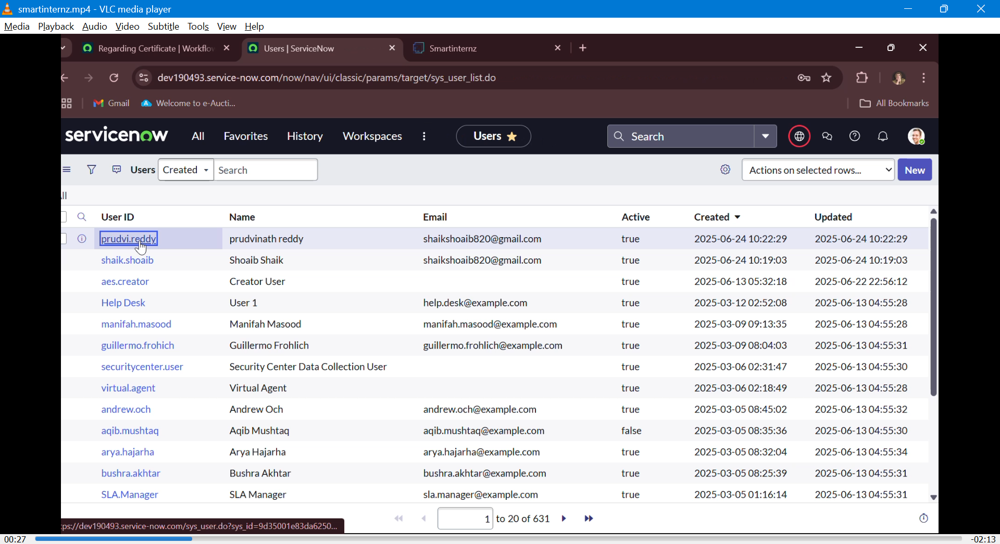

# SmartInternz
Streamlinling Ticket

# 🎯 Automated Ticket Routing System – ABC Corporation

## 📘 Project Description

This project focuses on implementing an **automated ticket routing system** using **ServiceNow** at **ABC Corporation** to improve operational efficiency in IT support operations. By automating the assignment of tickets based on issue type, we ensure timely resolution, reduce manual workload, and increase customer satisfaction.

---

## 🚀 Key Features

- Automated ticket routing based on specific issue types
- Use of Flow Designer for logic and triggers
- Role-based access control using ACLs
- Group-based ticket assignment (Certificates, Platform)
- Streamlined workflows using ServiceNow tables, roles, and groups

---

## 📂 Project 
project
│
├── Users                        

│   └── 
│

